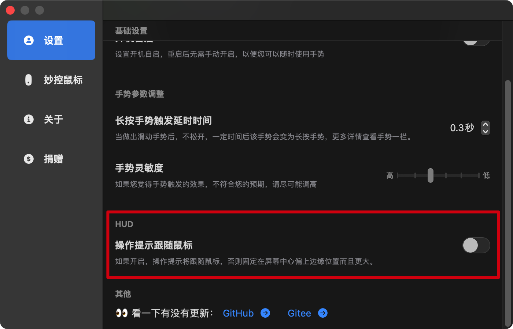

**交流**  
QQ【Mac窗口手势交流群】：[470741842](https://jq.qq.com/?_wv=1027&k=O8Fs7s3p)  
[Telgram](https://t.me/magicgesture)

# 窗口手势

如果您使用妙控鼠标，您可以通过一根手指（触控板则是双指），在窗口的标题栏操作以达到对应的效果。但是所有手势对本应用无效，原因是本应用不是一个可激活窗口，不会占用您的顶部菜单栏，当你点击窗口以外区域，应用窗口会自动消失。

## 下载  

- [去123云盘下载](https://www.123pan.com/s/817UVv-2eU3A)
- [去Gitee下载](https://gitee.com/rn-wyz/MagicGesturePackage/releases/download/1.0.1/Magic-Ges-Lite.dmg)  
- [去GitHub下载](https://github.com/WUYUEZONG/MagicGesturePackage/releases/download/1.0.1/Magic-Ges-Lite.dmg)

## 安装

将下载的文件夹中**Magic-Ges-Lite.app**文件拖动到**应用程序**文件夹即可完成安装

**如果您遇到“无法打开”？**

去：**设置 --- 隐私与安全性 --- 仍要打开** 就可以继续使用了。

## 开启辅助功能
软件中会使用到macOS相关的辅助功能API，所以需要您的辅助功能权限，才能相应的完成对其他窗口的设置。

**如何开启辅助功能？**

找到设置辅助功能页面：**设置 --- 隐私与安全性 --- 辅助功能**  
您也可以通过软件的弹窗直达设置页面

然后，通过 **"+"** 添加软件，或者将应用拖入。并开启开关。然后重新打开软件。
如果软件中显示**已开启**状态，则说明您操作成功。

## 开启自启

设置开机自启，重启系统后无需手动开启，以便您可以随时使用手势。当然，这不是强制要求的，开启与否取决于您的喜好。

## 长按手势

当做出滑动手势后，不松开，一定时间后该手势会变为长按手势，相应的则会触发长按的相关事件。您可以设置该时长。

## 手势灵敏度

如果您设置该项，一定程度能过滤很小幅度滑动的操作，但是如果能觉得这个过滤是不对的，请调整至**高**

## 手势介绍

**快速滑动**

- 当鼠标悬停于窗口顶部，向下快速滑动，触发窗口最小化
- 当鼠标悬停于窗口顶部，向上快速滑动，触发窗口最大化
- 当鼠标悬停于窗口顶部，向左快速滑动，触发窗口对齐占屏幕左边
- 当鼠标悬停于窗口顶部，向右快速滑动，触发窗口对齐占屏幕右边

**快速滑动，后稍等松手**

- 当鼠标悬停于窗口顶部，向下滑动并保持一定时间松开，将触发关闭窗口
- 当鼠标悬停于窗口顶部，向上滑动并保持一定时间松开，将触发点按全屏按钮，在窗口全屏时则退出全屏
- 当鼠标悬停于窗口顶部，向左滑动并保持一定时间松开，窗口占屏幕左边7/8
- 当鼠标悬停于窗口顶部，向右滑动并保持一定时间松开，窗口占屏幕右边7/8

## 停止或退出应用

您可以在状态栏找到如下图标进行控制。

## 关于

**项目地址**  
[GitHub项目代码](https://github.com/WUYUEZONG/Magic-Ges-Lite)  
[GitHub包文件](https://github.com/WUYUEZONG/MagicGesturePackage)  
[Gitee包文件](https://gitee.com/rn-wyz/MagicGesturePackage)

 ~代码尚未开源，也没有做好准备，暂且提供安装包供喜欢的人使用。~

**联系我**  
[GitHub@WUYUEZONG](https://github.com/WUYUEZONG)  
[邮件@WUYUEZONG](mailto:w.yzong@outlook.com)  
[BUGs反馈 - GitHub](https://github.com/WUYUEZONG/MagicGesturePackage/issues)  
[BUGs反馈 - Gitee](https://gitee.com/rn-wyz/MagicGesturePackage/issues)

**交流**  
QQ【Mac窗口手势交流群】：[470741842](https://jq.qq.com/?_wv=1027&k=O8Fs7s3p)  
[Telgram](https://t.me/magicgesture)

## 捐赠

这个东西挺重要的😄

## 更新
### 1.0.2 预发布
2022-12-14

- 修复退出全屏残影问题；
- 操作提示HUD添加可选项；

- 更精准找到对应窗口

### 1.0.1
2022-12-13

修复已知BUG
### 1.0
2022-12-12

第一个版本发布

