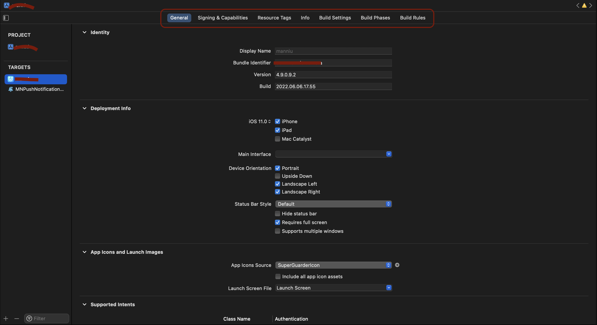

## 版本管理


多环境配置中，我们首先得清楚PROJECT / TARGET / SCHEME三者的含义


**PROJECT**

包含了项目所有代码、资源文件、所有信息，就是一个完整的项目；

**TARGET**

对指定代码和资源的具体构建方式，即，一个`target`对应一份`info.plist`和`xcconfig`文件。

**SCHEME**

是对指定`target`的环境配置。例如，**Run**时使用`Debug`配置文件还是用`Release`配置文件等等。

### xcconfig是什么？

xcconfig就是target的另一种配置文件。即下面视图的内容，在xcconfig中可以对一下内容**修改或者合并**。



所以，创建多个target，自然可以控制多个应用版本；

多个target需要注意的是，你需要维护多个info.plist以及target中的设置（`Build Setting`等）

不过target有个好处就是能控制文件是否参与编译。

如果，多版本中，只是对target中设置有所区别，那么使用xcconfig文件来控制版本是更为方便的，无需维护多个info.plist，不同设置使用不同xcconfig文件即可。


**不同需求，可根据情况实现。**


## Mach-O

Mach-O格式全称为Mach Object文件格式的缩写，是MacOS或者iOS上可执行的程序格式，类似于Windows上的PE格式 (Portable Executable)，linux上的ELF格式 (Executable and Linking Format)。

<!-- more -->

**Mach-O文件的分类**

- `Executable` 应用可执行文件
- `Dylib Library` 动态链接库（又称DSO或DLL）
- `Static Library` 静态链接库
- `Bundle` 不能被链接的Dylib，只能在运行时使用dlopen( )加载，可当做macOS的插件
- `Relocatable Object File` 可重定向文件类型

### Mach-O文件的组成

Mach-O文件主要包括三部分内容： Header(头部)、Load Commands(加载命令)、Data(数据区)

#### Header

指明了 CPU 架构、大小端序、文件类型、Load Commands 个数等一些基本信息，Headers 能帮助校验 Mach-O 合法性和定位文件的运行环境，64位架构为例，[Header结构](https://opensource.apple.com/source/xnu/xnu-792/EXTERNAL_HEADERS/mach-o/loader.h)定义如下

```objectivec
struct mach_header_64 {
    uint32_t    magic;        /* mach magic number identifier 魔数，用于快速确认该文件用于64位还是32位 */
    cpu_type_t    cputype;    /* cpu specifier，CPU**类型，比如 arm */
    cpu_subtype_t    cpusubtype;    /* machine specifier，对应的具体类型，比如arm64、armv7 */
    uint32_t    filetype;    /* type of file，文件类型，比如可执行文件、库文件、Dsym文件，demo中是2 `MH_EXECUTE`，代表可执行文件*/
    uint32_t    ncmds;        /* number of load commands 加载命令条数 */
    uint32_t    sizeofcmds;    /* the size of all the load commands  所有加载命令的大小 */
    uint32_t    flags;        /* flags 标志位 */
    uint32_t    reserved;    /* reserved  保留字段 */
};
```

**filetype**

- OBJECT，指的是 .o 文件或者 .a 文件；
- EXECUTE，指的是 IPA 拆包后的文件；
- DYLIB，指的是 .dylib 或 .framework 文件；
- DYLINKER，指的是动态链接器；
- DSYM，指的是保存有符号信息用于分析闪退信息的文件。


## LLVM-NM
**待更新...**

**参考**
[了解Mach-O文件](https://juejin.cn/post/7066791636205830181)
[2](https://juejin.cn/post/7045928743310721037)

