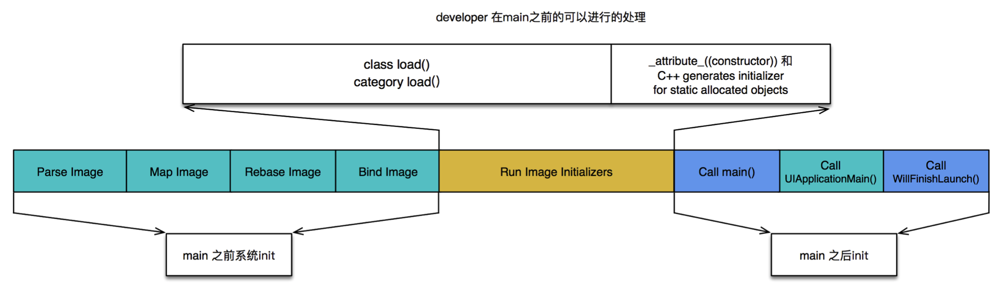

## APP启动的分类

### 冷启动

冷启动（Cold Launch）：从零开始启动APP

### 热启动

热启动（Warm Launch）：APP已经在内存中，在后台存活着，再次点击图标启动APP


💡 APP启动优化主要是针对冷启动进行优化的


**通过添加环境变量可以打印出APP的启动时间分析（Edit scheme -> Run -> Arguments）**

`DYLD_PRINT_STATISTICS`设置为1

如果需要更详细的信息，那就将`DYLD_PRINT_STATISTICS_DETAILS`设置为1

### 冷启动的三个阶段

- dyld
- runtime
- main

### dyld

dyld，即`dynamic link editor`，Apple的动态链接器，可以用来装载Mach-O文件（可执行文件、动态库等）

#### dyld做的事情

- 装载APP的可执行文件，同时会递归加载所有依赖的动态库
- 当dyld把可执行文件、动态库都装载完毕后，会通知Runtime进行下一步的处理

### APP启动时，runtime做的事情

- 调用`map_images`进行可执行文件内容的解析和处理
- 在`load_iamges`中调用`call_load_methods`，调用所有`Class`和`Category`的`+load`方法
- 进行各种objc结构的初始化（注册Objc类、初始化类对象等等）
- 调用`C++`静态初始化器和`__attribute__((constructor))`修饰的函数

**到此为止，可执行文件和动态库中所有的符号（Class、Protocol、Selector、IMP ...）都已经按格式成功加载到内存中，被runtime所管理**

## main

- APP的启动由dyld主导，将可执行文件加载到内存，顺便加载所有依赖的动态库
- 并由runtime负责加载成objc定义的结构
- 所有初始化工作结束后，dyld就会调用main函数
- 接下来就是UIApplicationMain函数，AppDelegate的application:didFinishLaunchingWithOptions:方法

## 启动优化按不同的阶段

### dyld

- 减少动态库、合并一些动态库（定期清理不必要的动态库）
- 减少Objc类、分类的数量、减少Selector数量（定期清理不必要的类、分类）
- 减少C++虚函数数量
- Swift尽量使用struct

### runtime

用+initialize方法和dispatch_once取代所有的__attribute__((constructor))、C++静态构造器、ObjC的+load

### main

- 在不影响用户体验的前提下，尽可能将一些操作延迟，不要全部都放在finishLaunching方法中
- 按需加载