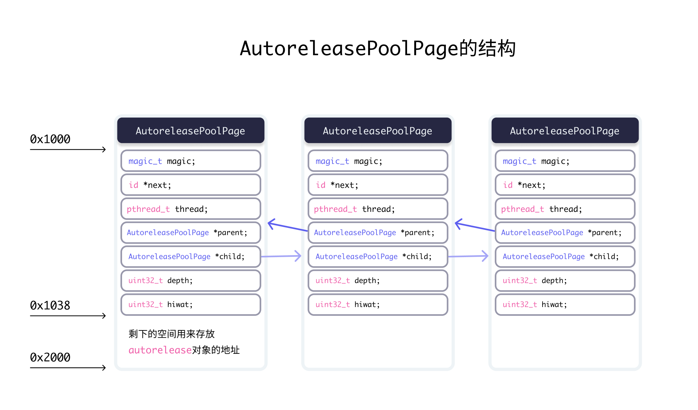


自动释放池的主要底层数据结构是：__AtAutoreleasePool、AutoreleasePoolPage；调用了autorelease的对象最终都是通过AutoreleasePoolPage对象来管理的


## AutoreleasePoolPage内部结构

- 每个 `AutoreleasePoolPage` 对象占用 `4096` 字节内存，除了用来存放它内部的成员变量，剩下的空间用来存放 `autorelease` 对象的地址
- 所有的 `AutoreleasePoolPage` 对象通过双向链表的形式连接在一起



## @autoreleasepool作用原理

```objectivec
@autoreleasepool {
        NSObject *obj = [[[NSObject alloc] init] autorelease];
    }

// 以上代码可以被解释为
{
		// atautoreleasepoolobj = 0x1038
		atautoreleasepoolobj = objc_autoreleasePoolPush();
    NSObject *obj = [[[NSObject alloc] init] autorelease];
		objc_autoreleasePoolPop(0x1038);
}
```

在大括号开始时将`autorelease`对象地址`push`进`AutoreleasePoolPage`，在大括号结束时`pop`出来。

### 说明

- 调用`push`方法会将一个`POOL_BOUNDARY`入栈，并且返回其存放的内存地址。
- 调用`pop`方法时传入一个`POOL_BOUNDARY`的内存地址，会从最后一个入栈的对象开始发送`release`消息，直到遇到这个`POOL_BOUNDARY`

`id *next`指向了下一个能存放`autorelease`对象地址的区域