## Block的本质

**`block`本质上也是一个OC对象，它内部也有个`isa指针`，`block`是封装了函数调用以及函数调用环境的OC对象。**

---

### `block`的底层结构

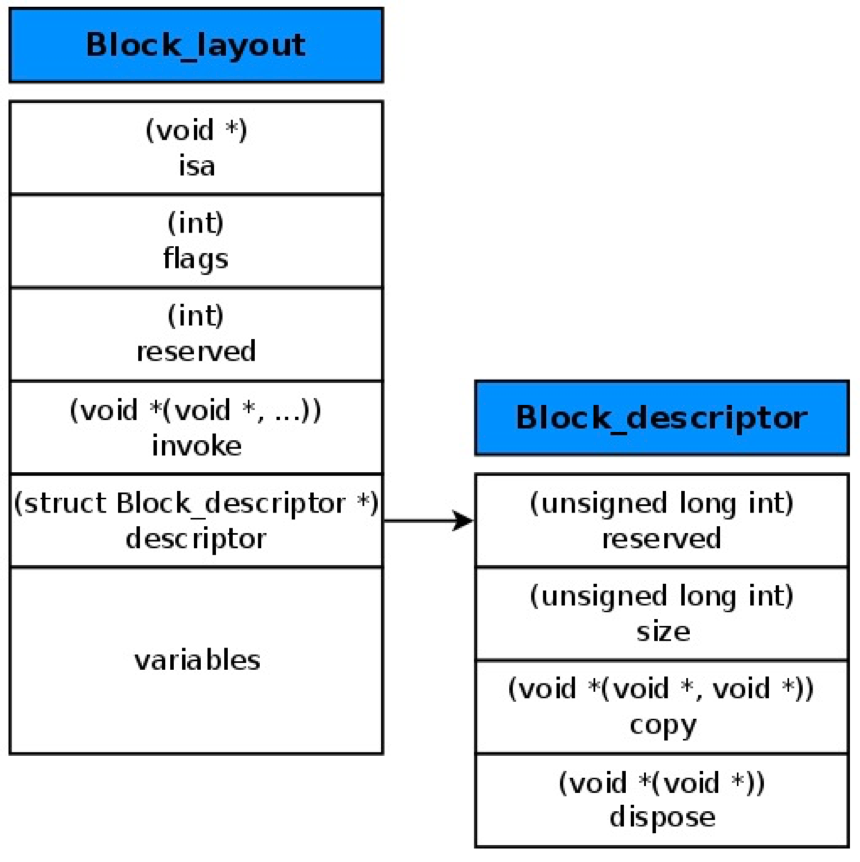

## block的变量捕获（capture）

---

为了保证block内部能够正常访问外部的变量，block有个变量捕获机制

|变量类型|是否捕获到block内部|访问方式|
|---|---|---|
|auto 修饰符（局部变量）|会捕获|值传递|
|static 修饰符（局部变量）|会捕获|指针传递|
|全局变量|不捕获|直接访问|

### 局部变量auto(自动变量)

---

- 平时写的局部变量，默认就有`auto`（自动变量，离开作用域 { } 就会自动销毁），该类型变量一般存储在Stack栈上。

```objectivec
#import <Foundation/Foundation.h>

int main(int argc, const char * argv[]) {
    @autoreleasepool {
        // 实际上是auto int age = 10, 表示自动释放的局部变量，离开作用域就会被释放。
        int age = 10;
        void(^block)(void) = ^{
            NSLog(@"age is %d", age);
        };
        block();
    }
    return 0;
}

// 将代码转为编译后代码
int main(int argc, const char * argv[]) {
    /* @autoreleasepool */ { __AtAutoreleasePool __autoreleasepool; 

        int age = 10;
        void(*block)(void) = ((void (*)())&__main_block_impl_0((void *)__main_block_func_0, &__main_block_desc_0_DATA, age));
        ((void (*)(__block_impl *))((__block_impl *)block)->FuncPtr)((__block_impl *)block);
    }
    return 0;
}
// 找到block最后生成的结构体，这里可以看到age成为该结构体的一个变量。
struct __main_block_impl_0 {
  struct __block_impl impl;
  struct __main_block_desc_0* Desc;
  int age;
  __main_block_impl_0(void *fp, struct __main_block_desc_0 *desc, int _age, int flags=0) : age(_age) {
    impl.isa = &_NSConcreteStackBlock;
    impl.Flags = flags;
    impl.FuncPtr = fp;
    Desc = desc;
  }
};
```

### 对象类型的auto变量

> `block`内部调用`对象`时，会自动生成相应的内存管理方法。并在适当的时候`retain`或`relese`
> 
- 当`block`内部访问了对象类型的`auto`变量时，如果`block`是在栈上，将不会对`auto`变量产生强引用。
- 调用`copy`方法将会调用`block`内部的`_Block_object_assign`函数，`_Block_object_assign`会根据`auto`变量的修饰符（`__strong`, `__weak`, `__unsafe_unretained`）做出相应的操作。形成强引用（`retain`）或者弱引用。
- `block`从堆上移除，会调用`blcok`内部的`dispose`函数，`dispose`函数内部会调用`_Block_object_dispose`函数，`_Block_object_dispose`会自动释放引用的`auto`变量。

### 局部变量static（静态局部变量）

[修饰符 extern/static/const/UIKIT_EXTERN(OC版extern) 的使用](https://www.cnblogs.com/chmhml/p/6855069.html)

静态变量（static 修饰的变量）都在**全局数据区**分配内存，包括静态全局变量和静态局部变量。直到程序结束运行，它才会被释放。

```objectivec
static int height = 20;

// static 局部变量也捕获，但和auto变量不同，static存储的是指针，指向->height内存地址
struct __main_block_impl_0 {
  struct __block_impl impl;
  struct __main_block_desc_0* Desc;
  int age;
  int *height;
  __main_block_impl_0(void *fp, struct __main_block_desc_0 *desc, int _age, int *_height, int flags=0) : age(_age), height(_height) {
    impl.isa = &_NSConcreteStackBlock;
    impl.Flags = flags;
    impl.FuncPtr = fp;
    Desc = desc;
  }
};
```

## block的类型

block有3种类型，可以通过调用class方法或者isa指针查看具体类型，最终都是继承自NSBlock类型

- **NSGlobalBlock** （ _NSConcreteGlobalBlock ）
- **NSStackBlock** （ _NSConcreteStackBlock ）
- **NSMallocBlock** （ _NSConcreteMallocBlock ）

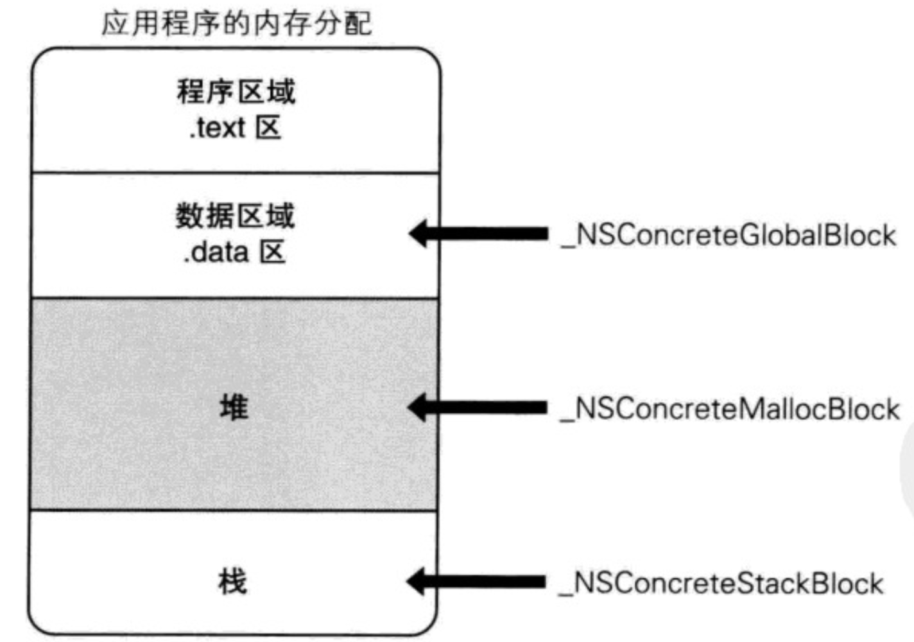

各类型所处内存位置如图

|block类型|环境|内存区、释放机制|
|-|-|-|
|NSGlobalBlock|没有访问auto变量|全局数据区：程序运行结束才会被释放|
|NSStackBlock|访问auto变量|栈区：变量在作用域结束就会被释放|
|NSMallocBlock|__NSStackBlock__调用了copy|堆区：需要程序员手动管理内存申请、释放|

## block的copy

|block类型|副本源的存储域|复制效果|
|-|-|-|
|_NSConcreteStackBlock|栈|从栈复制到堆|
|_NSConcreteGlobalBlock|程序数据区域|什么也不做|
|_NSConcreteMallocBlock|堆|引用计数器增加|


在ARC环境下，编译器会根据情况自动将栈上的`block`复制到**堆上**，比如以下情况


**`block`作为函数返回值时**

```objectivec
typedef void (^Block)(void);

- (Block)doSomething {
	Block b = ^{
		
	};
	return b;
}
```

**将`block`赋值给`__strong`指针时**

```objectivec
int a = 10;
// b访问了auto变量，理论上是__NSStackBlock__, 但是b 默认被__strong修饰
// 所以ARC中会被copy操作上堆。
// 实际上是 __strong Block b = ...
Block b = ^{
		NSLog(@"a is %d", a);
};
// weakb 访问了auto变量，所以在栈上__NSStackBlock__
__weak Block weakb = ^{
    NSLog(@"a is %d", a);
};
// ^{} 没有访问auto变量，所以为：__NSGlobalBlock__
NSLog(@"b class is %@, and block2 class is %@, weakb class is %@",
 [b class], [^{} class], [weakb class]);
// 打印输出
b class is __NSMallocBlock__, 
and block2 class is __NSGlobalBlock__, 
block3 class is __NSStackBlock__
```

**`block`作为Cocoa API中方法名含有`usingBlock`的方法参数时**

```objectivec
[[[NSArray alloc] init] enumerateObjectsUsingBlock:^(id  _Nonnull obj, NSUInteger idx, BOOL * _Nonnull stop) {
            
    }];
```

**`block`作为GCD API的方法参数时**

```objectivec
// dispatch_async(dispatch_queue_t  _Nonnull queue, <#^(void)block#>)
    dispatch_async(dispatch_get_main_queue(), ^{
        
    });
```

### MRC下block属性的建议写法

```objectivec
@property (copy, nonatomic) void (^block)(void);
```

### ARC下block属性的建议写法

```objectivec
@property (strong, nonatomic) void (^block)(void);
@property (copy, nonatomic) void (^block)(void);
```

## __block的本质是什么？

`__block`会将修饰对象封装成`__Block_byref_a_0`结构体，将该对象作为自己的成员变量，如果是对象类型，同时会生成`__Block_byref_id_object_copy`方法和`__Block_byref_id_object_dispose`，对其内存进行管理。

```objectivec
// 修饰基本数据类型
__block int a = 10;
NSLog(@"a is %d", a);
// 转为源码
struct __Block_byref_a_0 {
  void *__isa;
__Block_byref_a_0 *__forwarding;
 int __flags;
 int __size;
 int a;
};

// 修饰对象
__block NSObject *obj = [[NSObject alloc] init];
NSLog(@"str is %@", obj);
struct __Block_byref_obj_0 {
  void *__isa;
__Block_byref_obj_0 *__forwarding;
 int __flags;
 int __size;
 void (*__Block_byref_id_object_copy)(void*, void*);
 void (*__Block_byref_id_object_dispose)(void*);
 NSObject *obj;
};

```

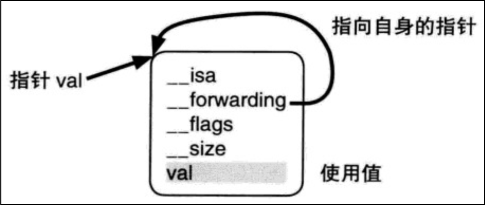

### __block的使用

> 编译器会将`__block`变量包装成一个对象
> 

#### `__block`可以用于解决`block`内部无法修改`auto`变量值的问题

```objectivec
int age = 10;
void (^block)(void) = ^{
    NSLog(@"age is %d", age);
};
age = 20;
block();

// 打印输出
2021-05-30 21:44:34.484323+0800 Strong&Weak[7070:466915] age is 10
```

这种情况，`block`捕获`age`，并将`age`的值赋值给了`block`对象中的`age`。所以之后改变`age`，也不改变`block`中的`age`。通过`__block`修饰，则会生成一个`__Block_byref_age_1`结构体

```objectivec
__block int age = 10;

struct __Block_byref_age_1 {
  void *__isa;
__Block_byref_age_1 *__forwarding; // 指向自己的指针
 int __flags;
 int __size;
 int age;
};

// 此时age = 20，在源码中是，第一个age（__Block_byref_age_1）
// 相当于age.age,将值赋值给age对象中的age。
// age.age指向的地址没有改变
(age.__forwarding->age) = 20;

// 所以打印输出自然是20
2021-05-30 22:03:02.218831+0800 Strong&Weak[7264:480507] age is 20
```

#### `__block`不能修饰全局变量、静态变量（`static`）

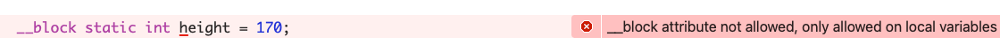

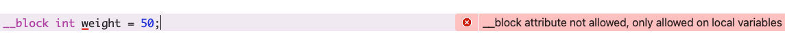

### __block的内存管理

- 当`block`在栈上时，并不会对`__block`变量产生强引用
- 当`block`被`copy`到堆时
    - 会调用`block`内部的`copy`函数
    - `copy`函数内部会调用`_Block_object_assign`函数
    - `_Block_object_assign`函数会对`__block`变量形成强引用（`retain`）
- 当`block`从堆中移除时
    - 会调用`block`内部的`dispose`函数
    - `dispose`函数内部会调用`_Block_object_dispose`函数
    - `_Block_object_dispose`函数会自动释放引用的`__block`变量（`release`）

### __block的__forwarding指针

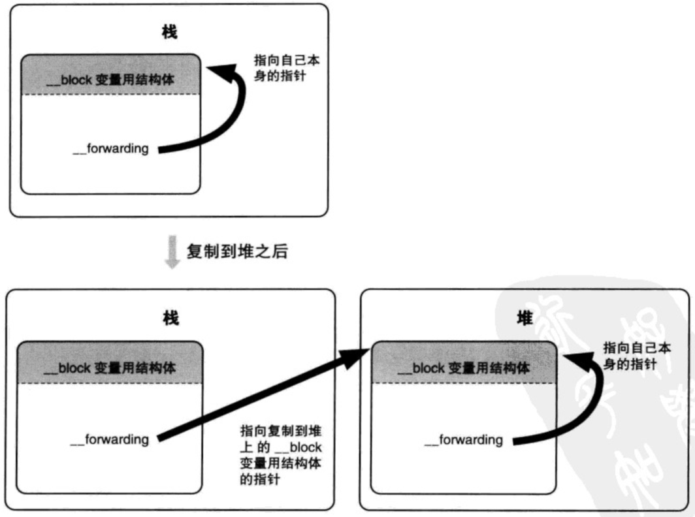

## 循环引用

### 循环引用的产生

- 对象持有block，而block持有对象就会造成，双方都无法释放，导致循环应用。

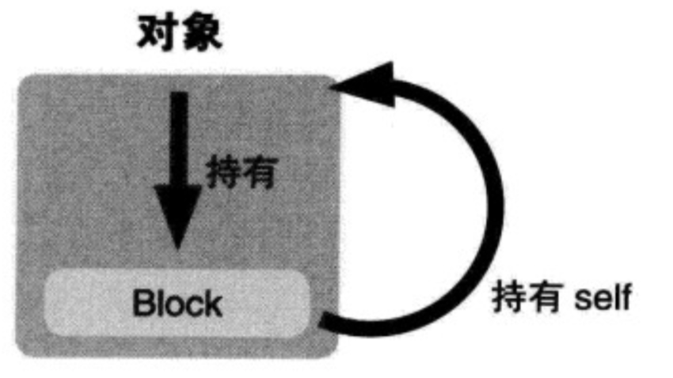

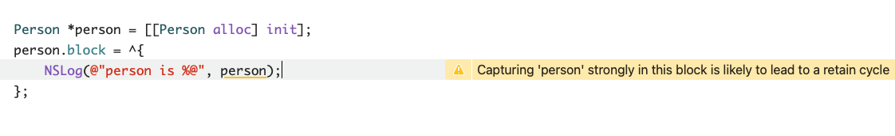

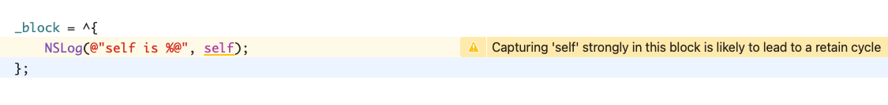

- 对象持有block，block持有__block变量，__block持有对象也会造成循环引用

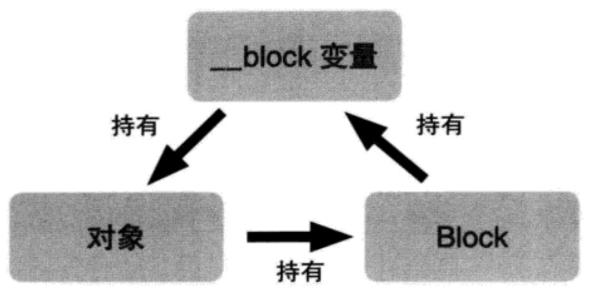

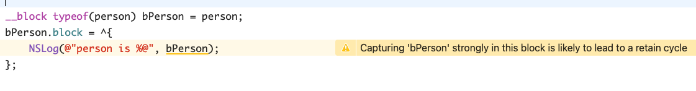

### 循环引用的解决

- 用`__weak`、`__unsafe_unretained`解决

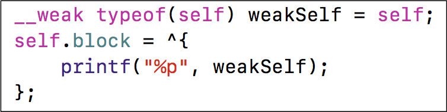

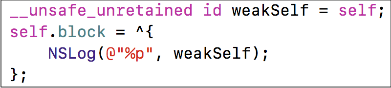

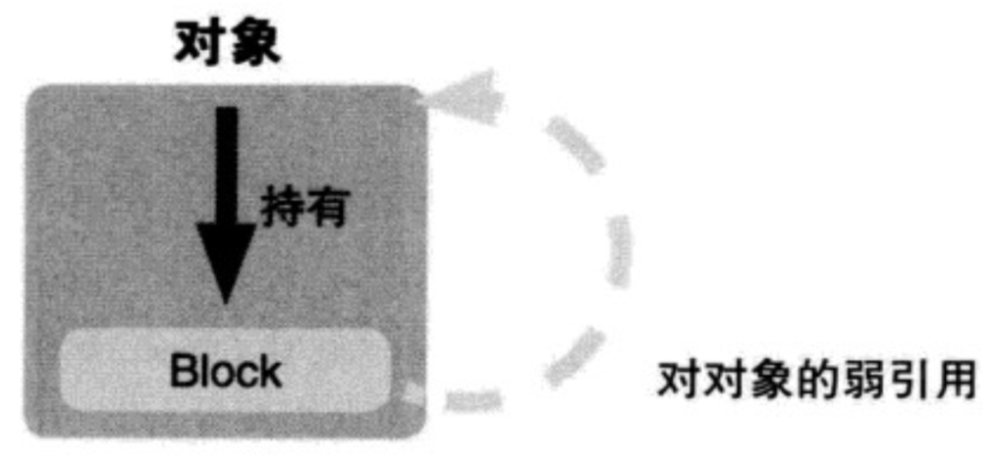

- 用`__block`解决（必须要调用block）

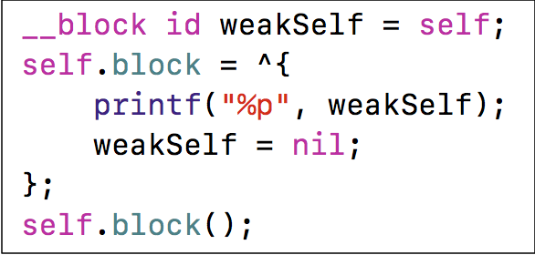

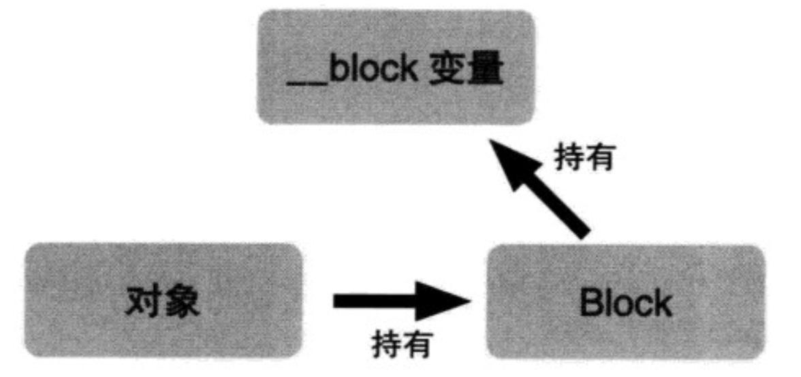

### 解决循环引用问题 - MRC

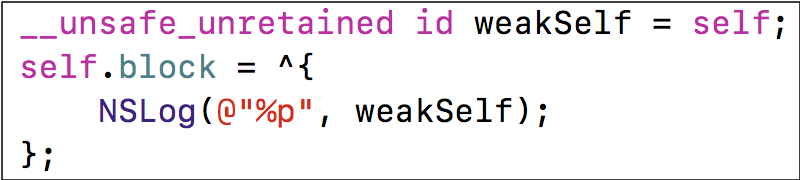

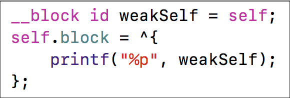

## 问题s

**Q：为什么捕获age（auto 自由变量）？**

**A：**局部自由变量在离开作用域时就会被释放，如果block在其他地方调用，此时，之前的变量已经被释放，所以需要事先保存下来，以防数据丢失。

**Q：以下代码的输出分别是什么？**

```objectivec
#import <Foundation/Foundation.h>

int main(int argc, const char * argv[]) {
    @autoreleasepool {
        // 实际上是auto int age = 10, 表示自动释放的局部变量，离开作用域就会被释放。
        int age = 10;
        static int height = 20;
        void(^block)(void) = ^{
            NSLog(@"age is %d and height is %d", age, height);
        };
        age = 1;
        height = 2;
        block();
    }
    return 0;
}
```

**A：**

```objectivec
age is 10 and height is 2
```

age = 10 时，已经被存储到block中，之后改变 age 并不会影响 block 中的 age。block 中 height 存储的时指向 height 的指针，所以在调用时取到的是 height 对应地址的值。

**Q：block在修改NSMutableArray，需不需要添加__block？**

A：不需要，**NSMutableArray本身是个对象，会被block强引用，block没有释放，NSMutableArray也不会被释放，加__block属于多此一举，凭空增加内存。**

**Q：block的属性修饰词为什么是copy？使用block有哪些使用注意？**

A：block一旦没有进行copy操作，就不会在堆上；使用注意：循环引用问题

**Q：`__block`的作用是什么？有什么使用注意点？**

A：__block可以用于解决block内部无法修改auto变量值的问题，__block不能修饰全局变量、静态变量（static）。