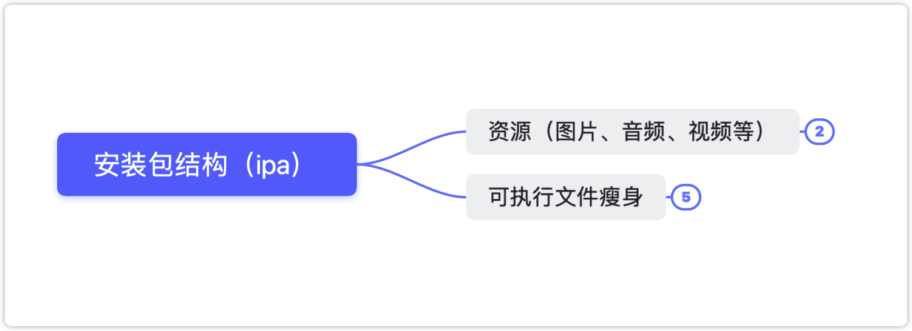

## 资源（图片、音频、视频等）

- 采取无损压缩
- 去除没有用到的资源：[https://github.com/tinymind/LSUnusedResources](https://github.com/tinymind/LSUnusedResources)

## 可执行文件瘦身

- 编译器优化
    - Strip Linked Product、Make Strings Read-Only、Symbols Hidden by Default设置为YES
    - 去掉异常支持，Enable C++ Exceptions、Enable Objective-C Exceptions设置为NO， Other C Flags添加-fno-exceptions
- 利用[AppCode](https://www.jetbrains.com/objc/) 检测未使用的代码：菜单栏 -> Code -> Inspect Code
- 编写LLVM插件检测出重复代码、未被调用的代码