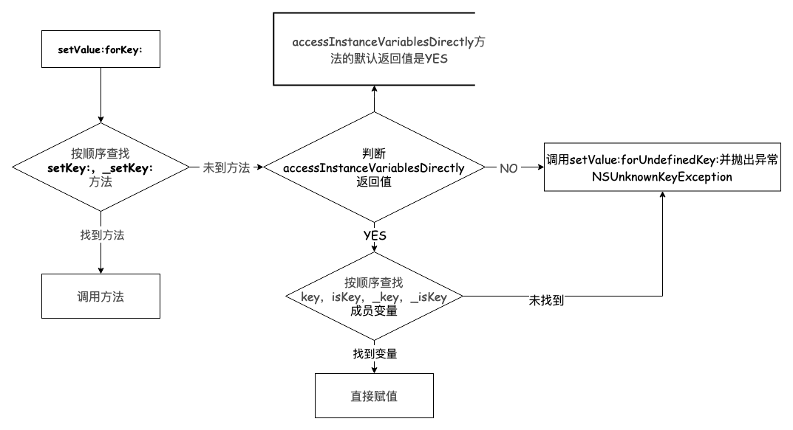
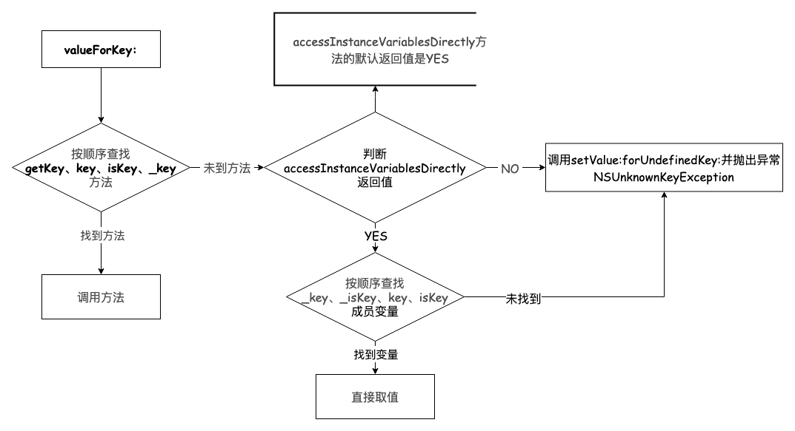

## KVC主要方法

```objectivec
- (void)setValue:(id)value forKeyPath:(NSString *)keyPath;
- (void)setValue:(id)value forKey:(NSString *)key;
- (id)valueForKeyPath:(NSString *)keyPath;
- (id)valueForKey:(NSString *)key;
```

## setValue: forKey: 的原理



## valueForKey: 的原理



## 使用KVC修改是否会触发KVO？（设置了监听）

使用KVC，不管是修改成员变量还是属性的值都会触发KVO。