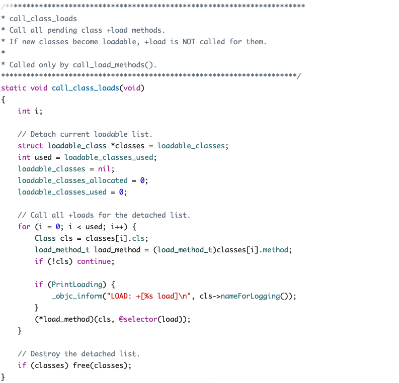
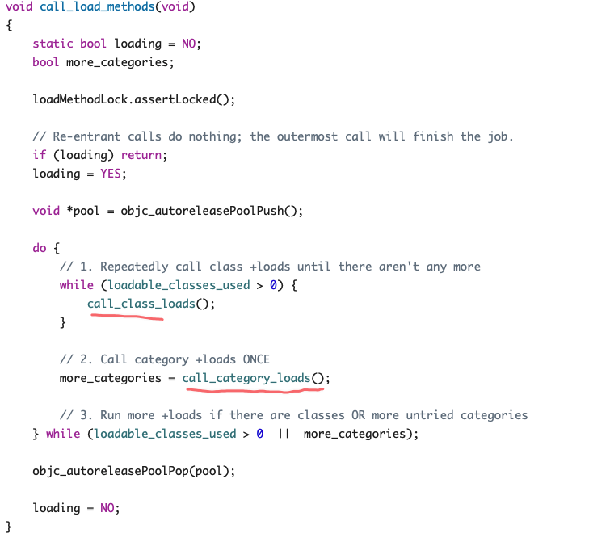


+load是runtime加载类、分类时调用（只会调用1次）+load是根据函数地址直接调用的。


## load调用顺序

1. 先调用类的`+load`
    - 先编译的类优先调用 `Category（分类）`
    - 调用子类的`+load`之前，会先调用父类的`+load`
2. 再调用分类的`+load`
    - 按照编译先后顺序调用（先编译。先调用）

## 阅读源码（objc4）

1. objc-os.mm
    1. _objc_init
    2. load_images
2. prepare_load_methods
    1. schedule_class_load
    2. add_class_to_loadable_list
    3. add_category_to_loadable_list
3. call_load_methods
    1. call_class_loads
    2. call_category_loads
    3. **(*load_method)(cls, SEL_load)**
    


+load方法是根据方法地址直接调用，并不是经过`objc_msgSend`函数调用
