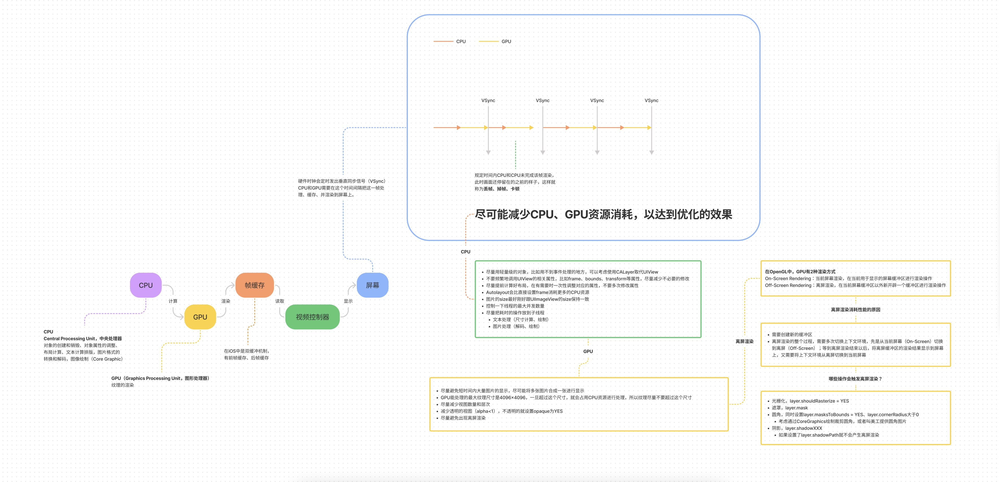

在屏幕成像的过程中，CPU和GPU起着至关重要的作用

[查看详情](https://www.figma.com/file/CdFtomuTIixnoMAmmy2hg2?embed_host=notion&kind=&node-id=0%3A1&viewer=1)

# CPU和GPU

**CPU（Central Processing Unit，中央处理器）**

对象的创建和销毁、对象属性的调整、布局计算、文本的计算和排版、图片的格式转换和解码、图像的绘制（Core Graphics）

**GPU（Graphics Processing Unit，图形处理器）**

纹理的渲染

**在iOS中是双缓冲机制，有前帧缓存、后帧缓存**

# 屏幕成像原理

硬件时钟会定时发出垂直同步信号（VSync）

CPU和GPU需要在这个时间间隔把这一帧处理、缓存、并渲染到屏幕上。

# 卡顿产生的原因

## 卡顿检测

平时所说的“卡顿”主要是因为在主线程执行了比较耗时的操作

可以添加Observer到主线程RunLoop中，通过监听RunLoop状态切换的耗时，以达到监控卡顿的目的

# 耗电优化

## 耗电来源

CPU处理，Processing

网络，Networking

定位，Location

图像，Graphics

## 优化

**尽可能降低CPU、GPU功耗**

**少用定时器**

### 优化I/O操作

尽量不要频繁写入小数据，最好批量一次性写入

读写大量重要数据时，考虑用`dispatch_io`，其提供了基于`GCD`的异步操作文件`I/O`的`API`。用`dispatch_io`系统会优化磁盘访问

数据量比较大的，建议使用数据库（比如`SQLite`、`CoreData`）

### 网络优化

- 减少、压缩网络数据
- 如果多次请求的结果是相同的，尽量使用缓存
- 使用**断点续传**，否则网络不稳定时可能多次传输相同的内容
- 网络不可用时，不要尝试执行网络请求
- 让用户可以取消长时间运行或者速度很慢的网络操作，设置合适的超时时间
- 批量传输，比如，下载视频流时，不要传输很小的数据包，直接下载整个文件或者一大块一大块地下载。如果下载广告，一次性多下载一些，然后再慢慢展示。如果下载电子邮件，一次下载多封，不要一封一封地下载

### 定位优化

- 如果只是需要快速确定用户位置，最好用`CLLocationManager`的`requestLocation`方法。定位完成后，会自动让定位硬件断电
- 如果不是导航应用，尽量不要实时更新位置，定位完毕就关掉定位服务
- 尽量降低定位精度，比如尽量不要使用精度最高的`kCLLocationAccuracyBest`
- 需要后台定位时，尽量设置`pausesLocationUpdatesAutomatically`为YES，如果用户不太可能移动的时候系统会自动暂停位置更新
- 尽量不要使用`startMonitoringSignificantLocationChanges`，优先考虑`startMonitoringForRegion`:

### 硬件检测优化

用户移动、摇晃、倾斜设备时，会产生动作(motion)事件，这些事件由加速度计、陀螺仪、磁力计等硬件检测。在不需要检测的场合，应该及时关闭这些硬件