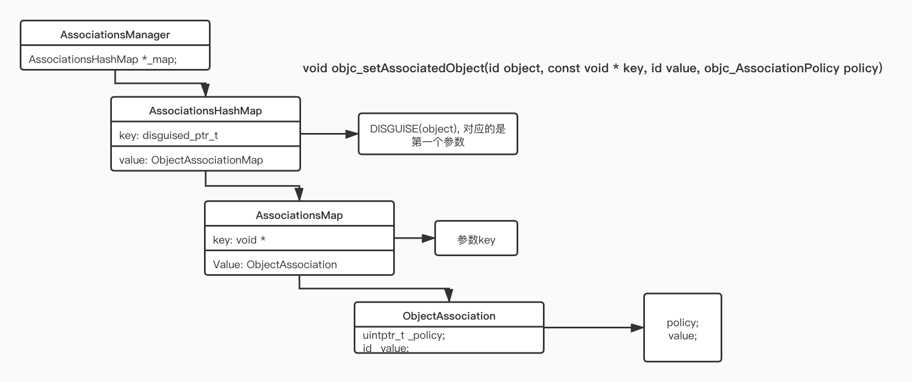
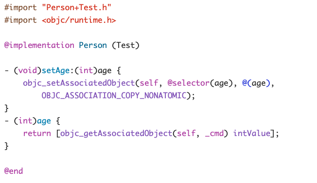

## AssociationObject关联对象的原理

实现关联对象技术的核心对象有
- AssociationsManager
- AssociationsHashMap
- ObjectAssociationMap
- ObjcAssociation

```objectivec
// 关系伪代码
class AssociationsManager {
	static AssociationsHashMap *_map;
};
class AssociationsHashMap: public unordered_map<disguised_ptr_t, ObjectAssociationMap>
class ObjectAssociationMap: public std::map<void *, ObjcAssociationMap>
class ObjcAssociationMap {
	uintptr_t _policy;
	id _value;
};
```

### 关联对象的结构

- 关联对象不是存储在被关联对象本身的内存中
- 关联对象存储在全局的统一的一个AssociationsManager中
- 设置关联对象为nil，就相当于是移除关联对象

| class | property |
|-------|----------|
|AssociationsManager| _map: AssociationsHashMap |
|AssociationsHashMap| @{disguised_ptr_t: ObjectAssociationMap}|
|ObjectAssociationMap| @{void*: ObjcAssociation}|
|ObjcAssociation| values |
|| OBJC_ASSOCIATION_ASSIGN|
|| OBJC_ASSOCIATION_RETAIN_NONATOMIC |
|| OBJC_ASSOCIATION_COPY_NONATOMIC |
|| OBJC_ASSOCIATION_RETAIN |
|| OBJC_ASSOCIATION_COPY |




## AssociationObject关联对象的使用

### 关联对象常用API

添加关联对象

```objectivec
void objc_setAssociatedObject(id object, const void * key, id value, objc_AssociationPolicy policy)
```

获取关联对象

```objectivec
id objc_getAssociatedObject(id object, const void * key)
```

移除所有关联对象

```objectivec
void objc_removeAssociatedObjects(id object)
```

### 关联对象方法Key参数的常见用法

```objectivec
static void *MyKey = &MyKey;
objc_setAssociatedObject(obj, MyKey, value, OBJC_ASSOCIATION_RETAIN_NONATOMIC)
objc_getAssociatedObject(obj, MyKey)

static char MyKey;
objc_setAssociatedObject(obj, &MyKey, value, OBJC_ASSOCIATION_RETAIN_NONATOMIC)
objc_getAssociatedObject(obj, &MyKey)

// 使用属性名作为key
objc_setAssociatedObject(obj, @"property", value, OBJC_ASSOCIATION_RETAIN_NONATOMIC);
objc_getAssociatedObject(obj, @"property");

// 使用get方法的@selecor作为key（推荐）
objc_setAssociatedObject(obj, @selector(getter), value, OBJC_ASSOCIATION_RETAIN_NONATOMIC)
objc_getAssociatedObject(obj, @selector(getter))
```

### 关联对象方法中 “**objc_AssociationPolicy**” 说明

[objc_AssociationPolicy参数说明](AssociationObject%E5%85%B3%E8%81%94%E5%AF%B9%E8%B1%A1%20c5f6e7a1551d46a689cfc461f28ab8ed/objc_AssociationPolicy%E5%8F%82%E6%95%B0%E8%AF%B4%E6%98%8E%205427096493b240628436ca1a9fe670ea.csv)

### 通过关联对象实现分类（Category）属性的get、set方法。

