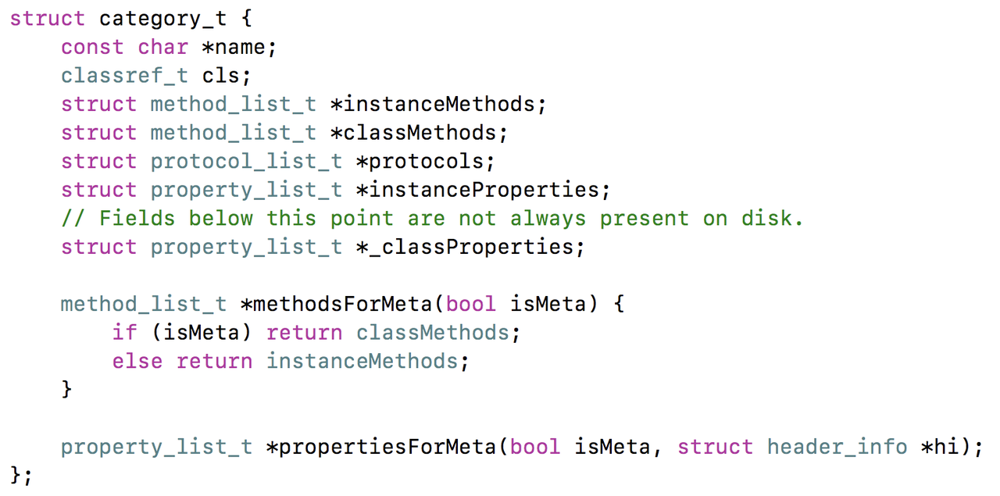
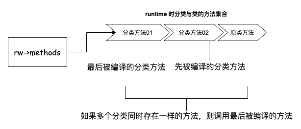
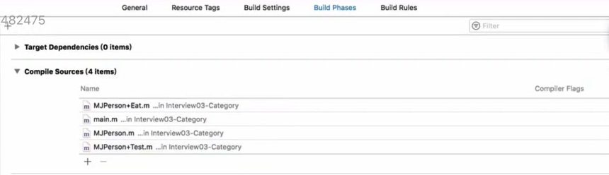
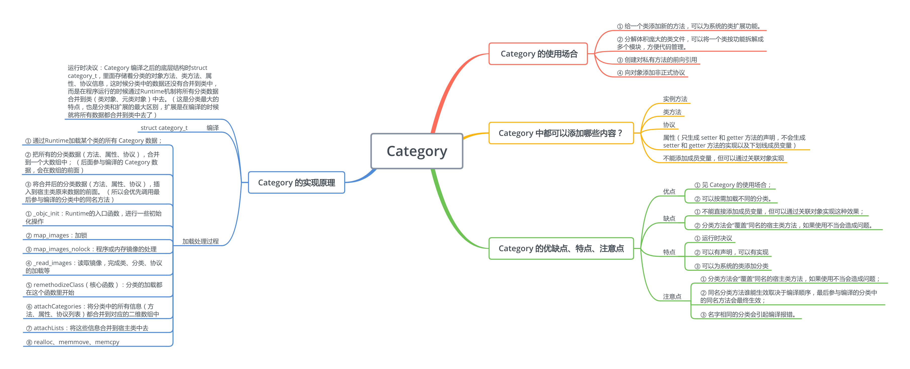
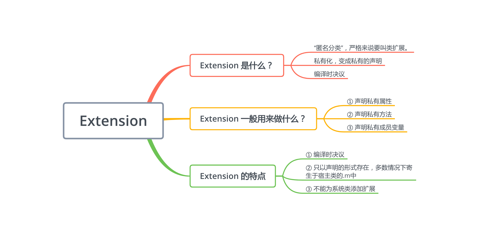

**category定义在objc-runtime-new.h中，结构如下：**



所以定义在分类中的属性、对象方法、类方法、协议等数据会被编译成和 `class` 对象中一样的数据类型，只使用了新的变量存储。在 `runtime`时，分类中的数据（属性、方法、协议）会被合并到原来的类、元类中。所以对象调用分类中的数据（属性、方法、协议）理论上是和调用类中的方法是一致的（`isa`）。





# 知识点

## 后编译的先调用

多个分类中如果存在相同的方法，编译顺序决定调用那个。`后编译的先调用`。



## Xcode中控制编译顺序



## Category和Class Extension的区别是什么？

Class Extension在编译的时候，它的数据就已经包含在类信息中，Category是在运行时，才会将数据合并到类信息中。

## 源码解读顺序

**objc-os.mm**

1. _objc_init
2. map_images
3. map_images_nolock

**objc-runtime-new.mm**

1. _read_images
2. remethodizeClass
3. attachCategories
4. attachLists
5. realloc、memmove、 memcpy

# 其他可阅读

[OC 底层探索 - Category 和 Extension](https://juejin.cn/post/6844904067987144711)

---





# Category的使用

新建文件时选择Category类型

```objectivec
#import "类名.h" 
@interface 类名 (类别名) 
// 在此处声明方法 
@end
#import "类名+类别名.h" 
@implementation 类名 (类别名) 
// 在此处实现声明的方法 
@end
```

# Extension（扩展）

一般的时候，Extension都是写在.m文件中，不单独建立一个扩展文件，且必须写在@implementation的上方，否则编译会报错。

1. 扩展文件为单一的.h文件
2. 命名为"类名_类别名.h"

```objectivec
#import "类名.h" 
@interface 类名 () 
// 在此添加私有成员变量、属性、声明方法 
@end
```