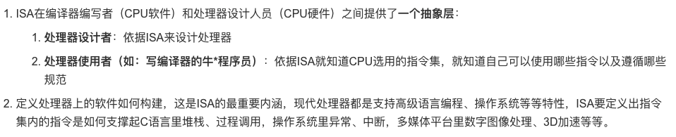
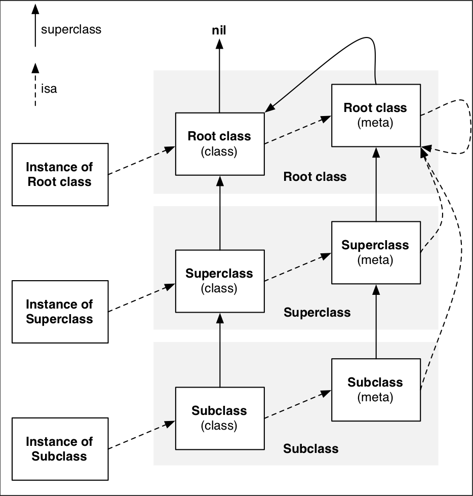

## oc为什么要存在isa

isa相当于oc对象中的id，oc是调用方法是通过objc_msgSend(,)消息机制，它要通过isa找到对应的属性、方法、协议等。

## 什么事消息机制？怎么理解消息机制？

当对象调用方法时，`[objc class]` 理论上其实是调用 `objc_msgSend(objc->isa, @selector(class))`方法通知objc去调用`class`方法。

---

## isa指针指向关系图



### instance实例对象的isa指针指向class类对象

当调用对象方法时，通过instance的isa找到class，最后找到对象方法的实现并调用。

### class类对象的isa指向meta-class元类对象

当调用类方法时，通过class的isa找到meta-class，最后找到类方法的实现并调用。

- instance的isa指向class
- class的isa指向meta-class
- meta-class的isa指向基类（NSObject）的meta-class
- class的superclass指向父类的class，如果没有父类，superclass的指针为nil
- meta-class的superclas指向父类的meta-class，基类的meta-class的superclass指向基类的class
- **instance调用对象方法的轨迹：**isa找到class，如果方法不存在，就通过superclass找到父类的class，直到找到为止，如果最后没有找到，就会报错：unrecognized selector
- **class调用类方法轨迹：**isa找到meta-class，方法不存在，就通过superclass找父类，如果一直到基类的mete-class都没找到，则会找到基类的class，如果有则调用对象方法，没有则：unrecognized selector
- 


从64位开始，isa指向的地址的需要一次位运算（& ISA_MASK），才能计算真实地址。


```objectivec
#if __arm64__
#define ISA_MASK 0x0000000ffffffff8ULL
#elif __x86_64__
#define ISA_MASK 0x00007fffffffffff8ULL
#endif

NSObject *obj = [[NSObject alloc] init];
p/x obj->isa // 打印输出obj的isa地址
```


class类对象、meta-class元类对象的本质结构都是struct objc_class


#### struct objc_class 结构

```objectivec
struct objc_class {
    Class isa;
    Class superclass;
    cache_t cache; // 方法缓存
    class_data_bits_t bits; // 用于获取具体的类信息
}；

class_rw_t *data = bits.data() // return bits & FAST_DATA_MASK

struct class_ro_t {
    uint32_t flags;
    uint32_t instanceStart;
    uint32_t instanceSize; // instance对象占用的内存空间大小
#ifdef __LP64__
    uint32_t reserved;
#endif
    const uint8_t * ivarLayout;
    const char * name // 类名
    method_list_t * baseMethodList;
    protocol_list_t * baseProtocols;
    const ivar_list_t * ivars;
    const uint8_t * weakIvarLayout;
    property_list_t *baseProperties;
};

struct class_rw_t {
    uint32_t flags;
    uint32_t version;
    const class_ro_t *ro;
    method_list_t *method;
    property_list_t *properties;
    const protocol_list_t *protocols;
    Class firstSubclass;
    Class nextSiblingClass;
    char *demangledName;
};
```