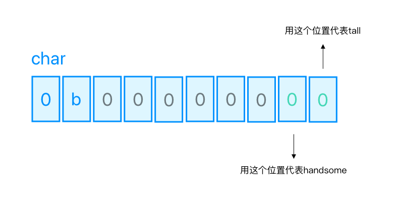

## 共用体

位域

```objectivec
// 位域
struct HGBitFiled {
    uintptr_t tall:1;
    uintptr_t rich:1;
    uintptr_t handsome:1;
};
```

将两个个BOOl类型存储在一个二进制数上。

- handsome
- tall



```objectivec
// 设定tall handsome初始值。
#define IS_TALL_MASK (1<<0)
#define IS_HANDSOME_MASK (1<<1)
// 定义共用体
union {
    char bits;
//位域，只是说明作用，说明tall站1位，handsome站1位
    struct {
        char tall:1;
        char handsome:1;
    };
} _isTallHandsom;

// 通过位运算实现方法。

- (void)setTall:(BOOL)tall {
    if (tall) {
// _isTallHandsom.bits = 0b00000001 = true
        _isTallHandsom.bits |= IS_TALL_MASK;
    } else {
// 1. ～ 取反：0b11111110 & 0b00000001 = 0b00000000 = false
        _isTallHandsom.bits &= ~IS_TALL_MASK;
    }
}
- (BOOL)isTall {
    return (_isTallHandsom.bits & IS_TALL_MASK);
}

- (void)setHandsome:(BOOL)handsome {
    if (handsome) {
        _isTallHandsom.bits |= IS_HANDSOME_MASK;
    } else {
        _isTallHandsom.bits &= ~IS_HANDSOME_MASK;
    }
}
- (BOOL)isHandsome {
    return (_isTallHandsom.bits & IS_HANDSOME_MASK);
}

// 使用
[self setTall:YES];
[self setHandsome:NO];
NSLog(@"tall is %d, handsome is %d", [self isTall], [self isHandsome]);
```