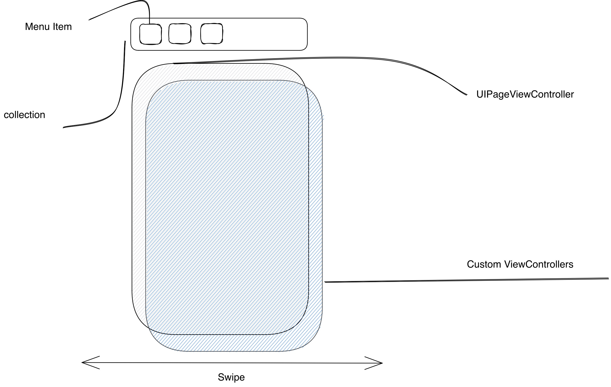

## 头文件
使用传统MVC的设计模式，通过 `dataSource` `delegate` 完成数据接入和动作交互。当然也提供一些基本属性快速方便的设置样式，比如：`WZPageMenuItemStyle` 标题按钮样式的基本设置。

```objc
@interface WZPageContentViewController : UIViewController

@property (weak, nonatomic) id<WZPageContentViewControllerDataSource> dataSource;
@property (weak, nonatomic) id<WZPageContentViewControllerDelegate> delegate;

@property (strong, nonatomic, readonly) UIPageViewController *pageController;
@property (strong, nonatomic, readonly) __kindof UIViewController *selectedController;
@property (assign, nonatomic, readonly) NSInteger selectedIndex;

@property(nonatomic) WZPageMenuItemStyle *selectedStyle;
@property(nonatomic) WZPageMenuItemStyle *normalStyle;

/// 是否展示分割线
@property(nonatomic) BOOL showDividingLine;
/// 是否展示位置指示器
@property(nonatomic) BOOL showIndicator;


- (void)reloadDataAt:(NSInteger)index;
/// 刷新菜单栏
- (void)reloadMenus;

- (void)registerClass:(Class)aClass identifier:(nonnull NSString *)identifier;
- (void)registerNib:(UINib *)nib identifier:(NSString *)identifier;

@end
```

设计结果肯定是以业务为依托，搭建基础框架，然后在条条框框里填写需求。所以先看一下代理设置了些啥，最后再拆解整个结构。

### WZPageContentViewControllerDataSource
1. 首先他需要一个标题数据源；`- (NSArray<NSString *> *)titlesForMenuItems;`
2. 然后给到对应数据源的页面；`- (__kindof UIViewController *)contentForPageContentAt:(NSInteger)index;`

如果你只需要这样的基础页面，那你完成设置了。因为内部已经实现了基础样式，选中的标题高亮，粗体。帮你缓存已经加载过的页面，同时给到对应`appear` `disappear`  正常 `UIViewController` 的生命周期这也是 `UIPageViewController` 自带的功能。

```objc
@protocol WZPageContentViewControllerDataSource <NSObject>

@required
/// 返回菜单栏标题数组
- (NSArray<NSString *> *)titlesForMenuItems;

/// 返回对应 index 的 Controller 该方法会缓存ViewController
///
/// title 为 KEY
///
- (__kindof UIViewController *)contentForPageContentAt:(NSInteger)index;

@optional
/// only can disable `UIPageViewControllerTransitionStylePageCurl` style gestrue
/// default is `false`
- (BOOL)enablePageCurlGesture;


/// default is `UIPageViewControllerTransitionStyleScroll`
- (UIPageViewControllerTransitionStyle)pageStyle;

/// 对应 cell 的宽度
- (CGFloat)widthOfMenuItemCollection:(UICollectionView*)collection atIndex:(NSInteger)index;

/// 标题栏的高度控制
- (CGFloat)heightOfMenuContainer;

/// default is top
///
/// - WZPageContentMenuPositionTop
/// - WZPageContentMenuPositionBottom
///
- (WZPageContentMenuPosition)menuPositionType;

/// register a class or nib first. this method will replace titles
///
/// - registerClass:identifier:
///
/// - registerNib:identifier:
- (__kindof UICollectionViewCell *)page:(WZPageContentViewController*)page collection:(UICollectionView*)collection  titleViewForMenuItemsAt:(NSIndexPath *)indexPath;


@end
```

**稍微进行一点自定义**

page的动画相关目前是开放的，我想有时间完善可能会关闭它，可以更纯粹些。

```objc
- (BOOL)enablePageCurlGesture;
- (UIPageViewControllerTransitionStyle)pageStyle;
```

定义每个标题的宽度；


这里有个小技巧可以帮助你实现如果只有一个或两个标题时又要居中对齐的需求。
**设置collection的左右间距和标题宽度，使它们之和占满屏幕**


```objc
- (CGFloat)widthOfMenuItemCollection:(UICollectionView*)collection atIndex:(NSInteger)index;
```

既然 `collection` 是那么把 `Cell` 的权限交给你，在这之前请注册你的 `Cell`，可以在 `WZPageContentViewController` 头文件找到对应的方法。

```objc
- (__kindof UICollectionViewCell *)page:(WZPageContentViewController*)page collection:(UICollectionView*)collection  titleViewForMenuItemsAt:(NSIndexPath *)indexPath;
```

### WZPageContentViewControllerDelegate
这里也给到了些简单好用的方法。

```objc
@protocol WZPageContentViewControllerDelegate <NSObject>

@optional

/// 将要点击index, 此时 `selectedIndex` 还没有变更
- (void)pageContent:(WZPageContentViewController*)content willSelectedAt:(NSInteger)index;

/// 点击MenuItem触发的事件： 已经点击index, 此时 `selectedIndex` 已变更
- (void)pageContent:(WZPageContentViewController*)content didSelectedAt:(NSInteger)index;

/// 是否需要响应对应的坐标的按钮，默认为true
///
/// return false 将不会响应 `willSelectedAt:`  `didSelectedAt:`
///
- (BOOL)pageContent:(WZPageContentViewController *)content shouldSelectAt:(NSInteger)index;


@end
```

## 结构

拆解一下结构。是很简单的一个结构，完成所有也只是三四百行。所以造东西主要还是思路问题。

