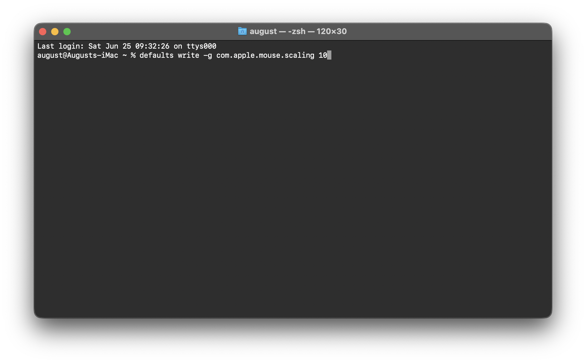

这里可能会记录些生活中时间上的片段，比如，突发的灵感，有趣的，快了的，而不好的，我不知道会不会在这里出现，也不希望，看时间吧！


## Mac电脑更改鼠标追踪速度


通过终端输入命令：
```shell
defaults write -g com.apple.mouse.scaling 10
```
10 表示要设置的速度，可以根据自己手感设置，**重启生效**。

另外，您还可以查看当前鼠标速度：
```shell
defaults read -g com.apple.mouse.scaling
```

BUT, 如果设置完去系统设置中修改鼠标速度，则命令设置的速度会失效


----
[工作笔记](../notebook/index.html)